# Tài liệu Activity Diagram - Smart Food Tour App

## 1. Mục đích tài liệu

Tài liệu này tách riêng phần activity diagram ra khỏi PRD để PRD gọn hơn, đồng thời giúp nhóm dự án dễ theo dõi các luồng nghiệp vụ chính dưới dạng sơ đồ.

Tổng số activity diagram trong tài liệu này là 12, kèm 1 sequence diagram tổng hợp.

> Lưu ý: AD-001 và AD-002 mô tả luồng vào app theo PRD_01 (visitor-first, QR-based). Các AD còn lại mô tả luồng nghiệp vụ chung.

## 2. Danh mục activity diagram

| Mã | Tên lược đồ | Mô tả ngắn |
|---|---|---|
| AD-001 | Chọn cách truy cập | Mô tả luồng visitor mở app và chọn vào trang chủ hoặc quét QR |
| AD-002 | QR Access và khởi tạo session | Mô tả luồng quét QR, tạo session, bootstrap dữ liệu đầy đủ |
| AD-003 | Explore Mode | Mô tả luồng người dùng khám phá POI trên bản đồ |
| AD-004 | Tour Mode | Mô tả luồng người dùng chọn tour và đi theo hành trình |
| AD-005 | Quản lý POI theo vai trò | Mô tả quy trình admin hoặc manager tạo và cập nhật POI theo phạm vi quyền |
| AD-006 | Admin publish và theo dõi hệ thống | Mô tả quy trình publish snapshot và theo dõi người dùng hoạt động |
| AD-007 | Upload ảnh POI và cập nhật nội dung | Mô tả luồng upload ảnh và cập nhật translation/audio cho POI |
| AD-008 | Chọn vị trí trên bản đồ | Mô tả luồng geocode, chọn gợi ý, ghim map và reverse geocode |
| AD-009 | Manager cập nhật nội dung POI | Mô tả quy trình manager chỉnh sửa nội dung POI thuộc quyền sở hữu |
| AD-010 | Chatbot hỏi đáp | Mô tả quy trình gửi câu hỏi và nhận phản hồi chatbot |

## 3. Chi tiết từng activity diagram

### AD-001 - Chọn cách truy cập

Lược đồ này nói về quá trình visitor mở ứng dụng và lựa chọn cách vào app theo PRD_01: vào trang chủ để xem bản đồ và POI cơ bản mà không cần QR, hoặc quét QR để vào phiên trải nghiệm đầy đủ.

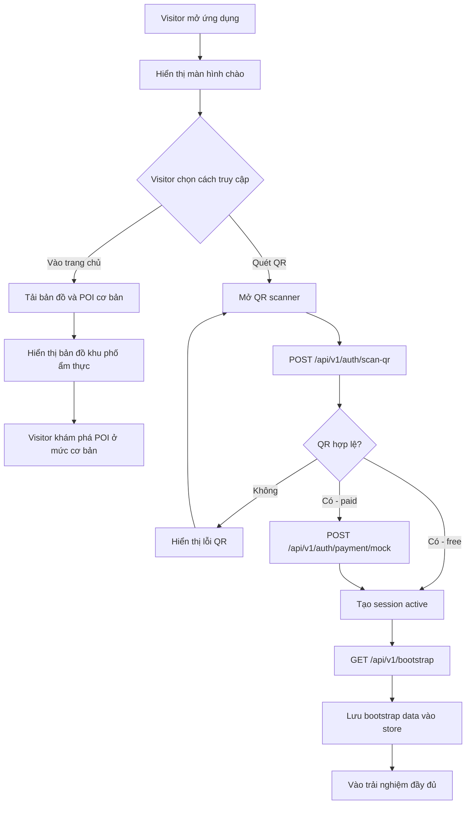

### AD-002 - QR Access và khởi tạo session

Lược đồ này nói về quá trình quét QR, validate, tạo session, gọi bootstrap và chuẩn bị dữ liệu đầy đủ cho phiên trải nghiệm visitor theo PRD_01.

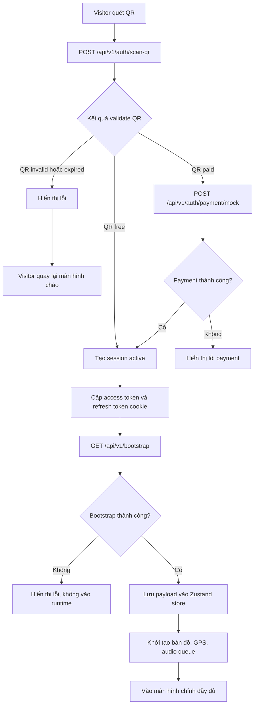

### AD-003 - Explore Mode

Lược đồ này nói về cách visitor duyệt POI trên bản đồ, xem chi tiết và tương tác với nội dung liên quan đến điểm đến.

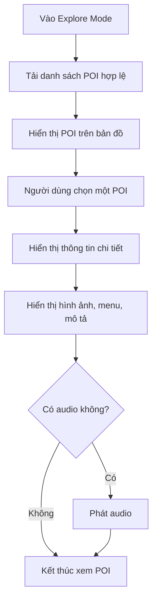

### AD-004 - Tour Mode

Lược đồ này nói về cách người dùng chọn một tour, di chuyển theo lộ trình và nhận nội dung theo thứ tự hành trình.

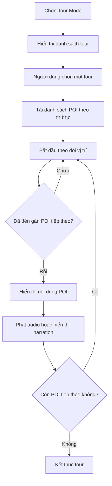

### AD-005 - Quản lý POI theo vai trò

Lược đồ này nói về quy trình admin hoặc manager tạo, cập nhật POI theo phạm vi quyền hiện hành.

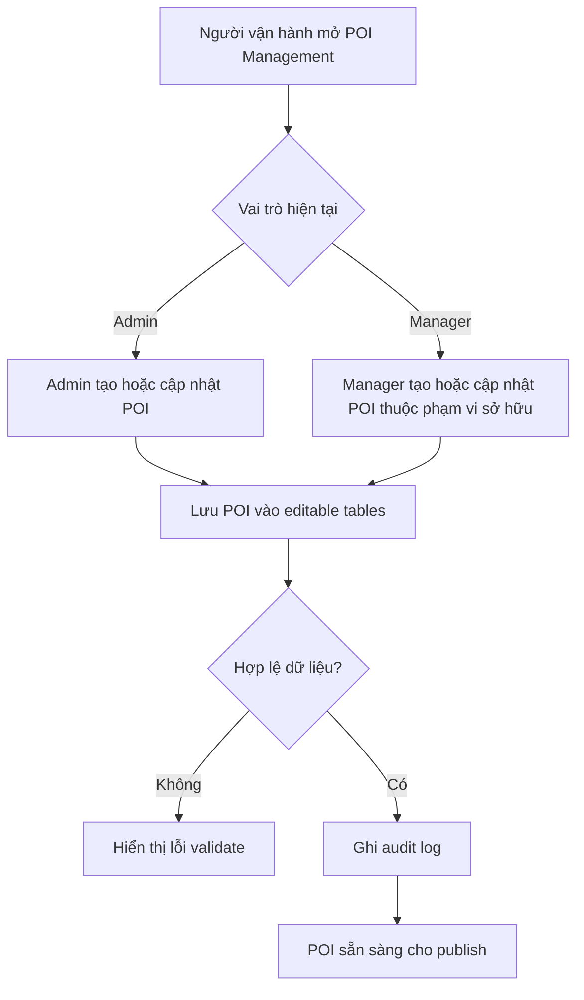

### AD-006 - Admin publish và theo dõi hệ thống

Lược đồ này nói về quy trình admin publish dữ liệu và theo dõi chỉ số online devices trên dashboard.

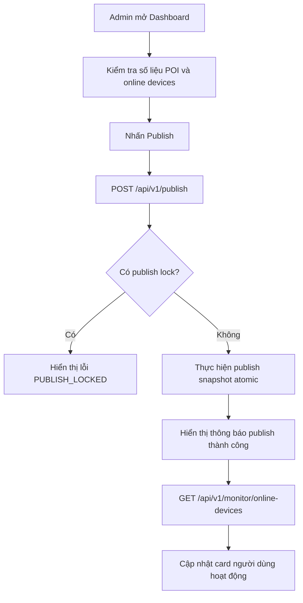

### AD-007 - Upload ảnh POI và cập nhật nội dung

Lược đồ này nói về quy trình chọn ảnh POI, upload ảnh, sau đó cập nhật translation và audio_url trước khi lưu POI.

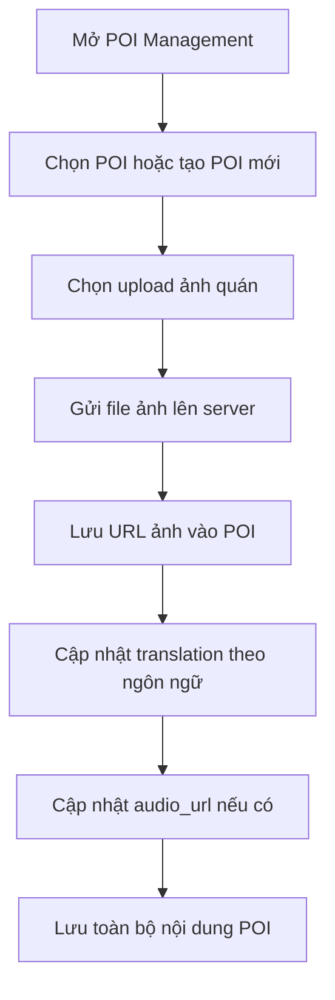

### AD-008 - Chọn vị trí trên bản đồ

Lược đồ này nói về quy trình nhập địa chỉ, nhận gợi ý geocode, ghim điểm trên bản đồ và cập nhật vị trí POI.

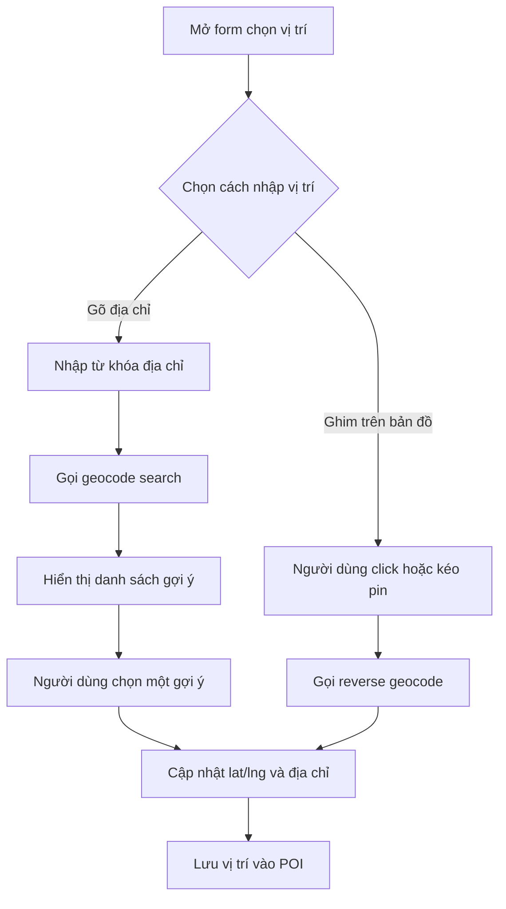

### AD-009 - Manager cập nhật nội dung POI

Lược đồ này nói về quy trình manager chỉnh sửa POI thuộc quyền sở hữu, bao gồm thông tin, dịch thuật, hình ảnh và vị trí.

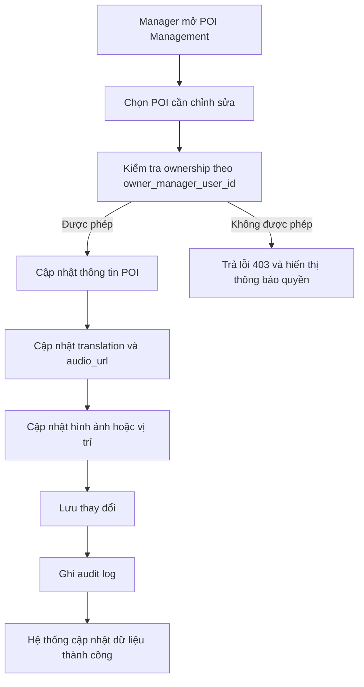

### AD-010 - Chatbot hỏi đáp

Lược đồ này nói về quy trình người dùng đặt câu hỏi bằng ngôn ngữ tự nhiên và hệ thống trả phản hồi chatbot.

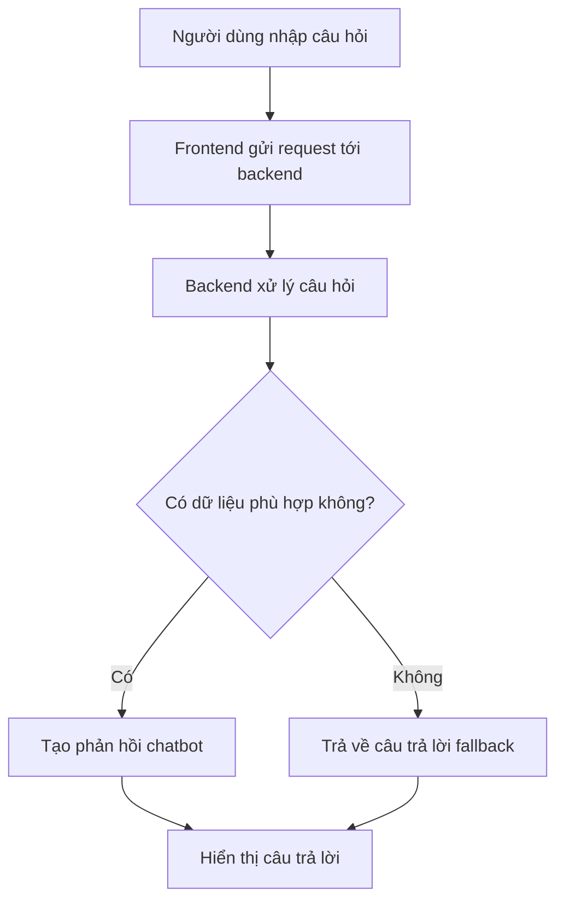

## 4. Tóm tắt phục vụ review

1. Tài liệu này hiện có 12 activity diagram và 1 sequence diagram tổng hợp.
2. Đây là bộ diagram cần có để mô tả đầy đủ các luồng nghiệp vụ chính của Smart Food Tour App.
3. Nếu cần nộp học thuật hoặc báo cáo chính thức, có thể dùng trực tiếp file này làm phụ lục sơ đồ cho PRD.

## 5. Phần bổ sung Manager (Thay thế)

### AD-011 - Manager đăng nhập và quản lý POI

Lược đồ này mô tả manager đăng nhập riêng và chỉ thao tác POI thuộc phạm vi quản lý.

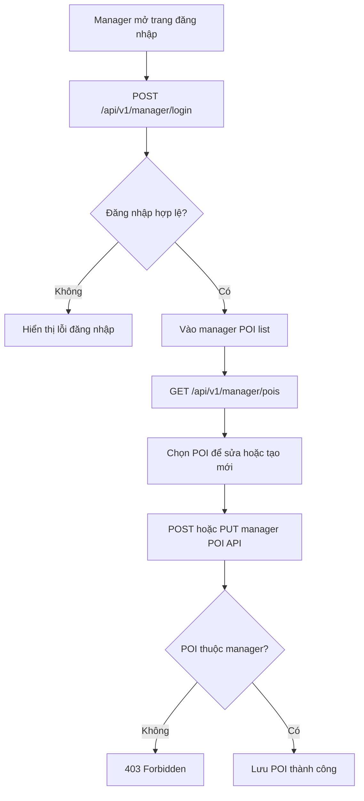

### AD-012 - Manager upload POI image

Lược đồ này mô tả upload file ảnh trực tiếp cho POI manager sở hữu.

```mermaid
flowchart TD
    A[Manager mở POI editor] --> B[Chọn file ảnh]
    B --> C[POST /api/v1/manager/pois/{id}/image]
    C --> D{File hợp lệ?}
    D -->|Không| E[400 hoặc 413, hiển thị lỗi]
    D -->|Có| F[Lưu file và metadata]
    F --> G[Cập nhật image_url trên POI]
```

## 6. Lược đồ Sequence (Đã chuẩn hóa)

### SD-001 - Visitor QR Runtime và Admin Publish (Tổng thể)

Lược đồ sequence dưới đây được viết lại theo kiến trúc hiện tại: visitor vào app bằng QR, bootstrap dữ liệu, chat theo bootstrap version, admin cập nhật và publish snapshot, monitor cập nhật số lượng online devices.

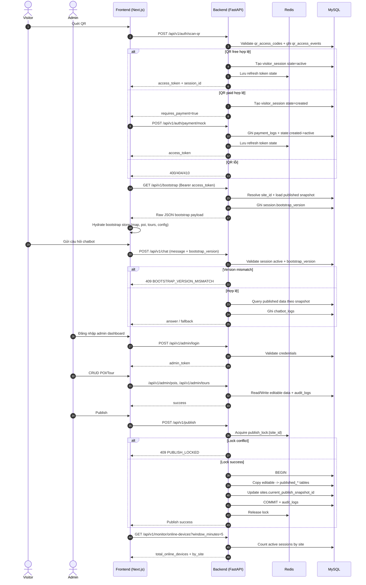

Ghi chú:

1. Sau bootstrap, visitor runtime không gọi GET /api/v1/pois hoặc GET /api/v1/tours.
2. Publish là atomic theo site_id, dùng Redis lock để tránh publish song song.
3. Chatbot chỉ được tra cứu dữ liệu published của đúng bootstrap_version.

