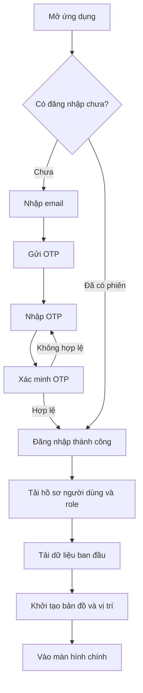
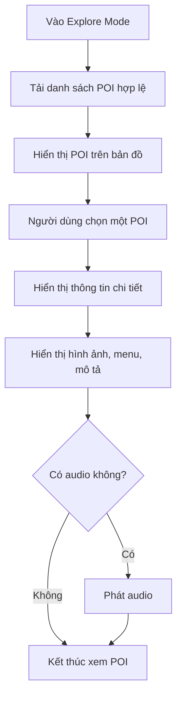
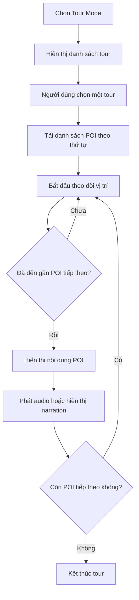
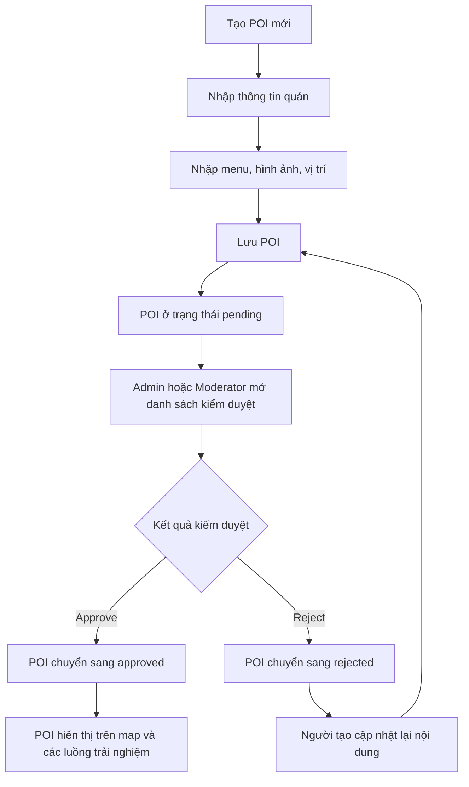
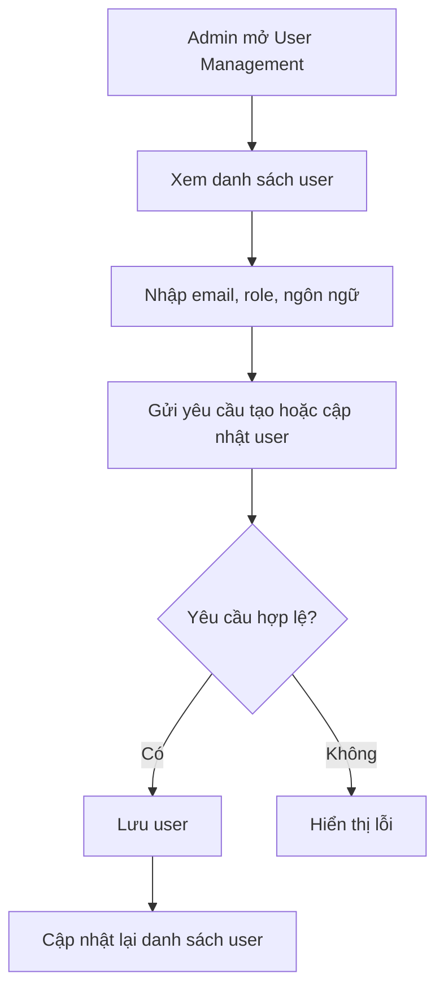
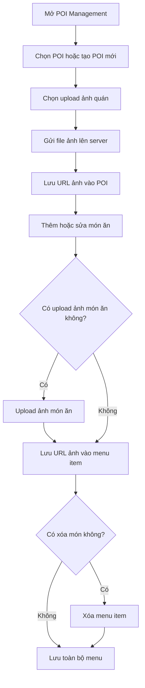
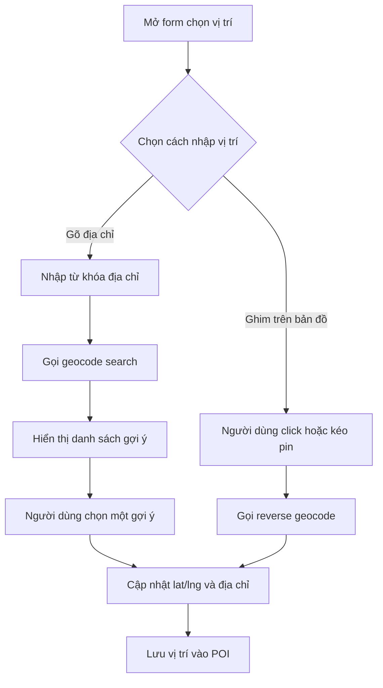
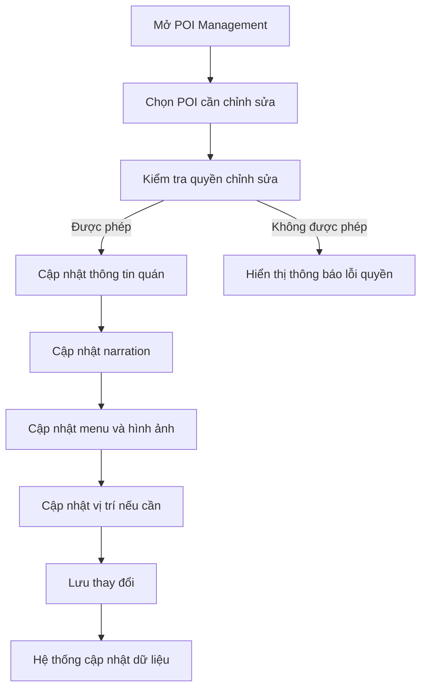
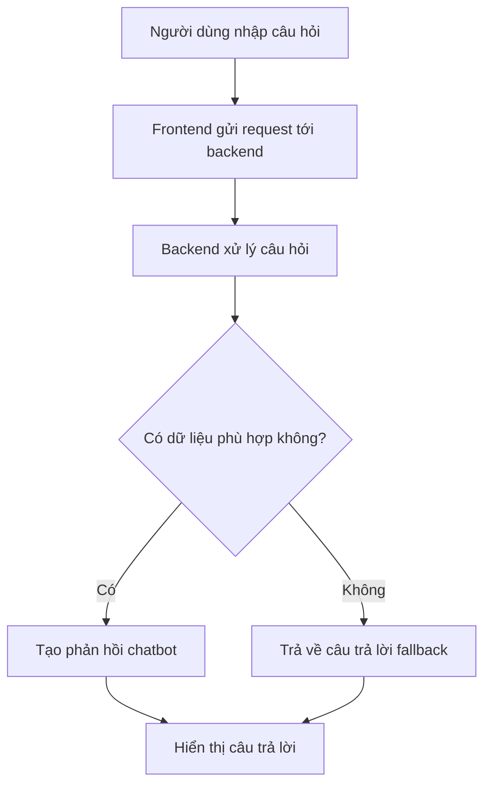

# Tài liệu Activity Diagram - Smart Food Tour App

## 1. Mục đích tài liệu

Tài liệu này tách riêng phần activity diagram ra khỏi PRD để PRD gọn hơn, đồng thời giúp nhóm dự án dễ theo dõi các luồng nghiệp vụ chính dưới dạng sơ đồ.

Tổng số activity diagram trong tài liệu này là 9.

## 2. Danh mục activity diagram

| Mã | Tên lược đồ | Mô tả ngắn |
|---|---|---|
| AD-001 | Đăng nhập và khởi tạo | Mô tả luồng mở app, đăng nhập, xác minh OTP, tải dữ liệu ban đầu |
| AD-002 | Explore Mode | Mô tả luồng người dùng khám phá POI trên bản đồ |
| AD-003 | Tour Mode | Mô tả luồng người dùng chọn tour và đi theo hành trình |
| AD-004 | Gửi POI và kiểm duyệt | Mô tả quy trình tạo POI, gửi duyệt, approve hoặc reject |
| AD-005 | Admin quản lý user | Mô tả quy trình admin tạo, cập nhật, xem user |
| AD-006 | Upload ảnh POI và cập nhật menu | Mô tả luồng upload ảnh và quản lý menu |
| AD-007 | Chọn vị trí trên bản đồ | Mô tả luồng geocode, chọn gợi ý, ghim map và reverse geocode |
| AD-008 | Owner hoặc Moderator cập nhật nội dung | Mô tả quy trình chỉnh sửa nội dung quán |
| AD-009 | Chatbot hỏi đáp | Mô tả quy trình gửi câu hỏi và nhận phản hồi chatbot |

## 3. Chi tiết từng activity diagram

### AD-001 - Đăng nhập và khởi tạo

Lược đồ này nói về quá trình người dùng mở ứng dụng, xác thực, nhận quyền và chuẩn bị dữ liệu ban đầu để bắt đầu sử dụng hệ thống.

### AD-002 - Explore Mode

Lược đồ này nói về cách visitor duyệt POI trên bản đồ, xem chi tiết và tương tác với nội dung liên quan đến điểm đến.

### AD-003 - Tour Mode

Lược đồ này nói về cách người dùng chọn một tour, di chuyển theo lộ trình và nhận nội dung theo thứ tự hành trình.

### AD-004 - Gửi POI và kiểm duyệt

Lược đồ này nói về quy trình owner, moderator hoặc admin tạo POI và quy trình kiểm duyệt POI bởi admin hoặc moderator.

### AD-005 - Admin quản lý user

Lược đồ này nói về quy trình admin tạo hoặc cập nhật tài khoản vận hành trong dashboard.

### AD-006 - Upload ảnh POI và cập nhật menu

Lược đồ này nói về quy trình chọn file ảnh, upload ảnh cho quán hoặc món ăn, sau đó thêm, sửa, xóa menu trước khi lưu POI.

### AD-007 - Chọn vị trí trên bản đồ

Lược đồ này nói về quy trình nhập địa chỉ, nhận gợi ý geocode, ghim điểm trên bản đồ và cập nhật vị trí POI.

### AD-008 - Owner hoặc Moderator cập nhật nội dung

Lược đồ này nói về quy trình chỉnh sửa nội dung quán hiện có, bao gồm thông tin quán, narration, menu, hình ảnh và vị trí.

### AD-009 - Chatbot hỏi đáp

Lược đồ này nói về quy trình người dùng đặt câu hỏi bằng ngôn ngữ tự nhiên và hệ thống trả phản hồi chatbot.

## 4. Tóm tắt phục vụ review

1. Tài liệu này hiện có 9 activity diagram.
2. Đây là bộ diagram cần có để mô tả đầy đủ các luồng nghiệp vụ chính của Smart Food Tour App.
3. Nếu cần nộp học thuật hoặc báo cáo chính thức, có thể dùng trực tiếp file này làm phụ lục sơ đồ cho PRD.
